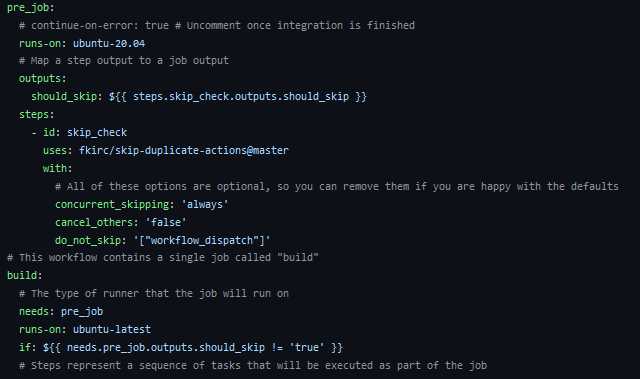
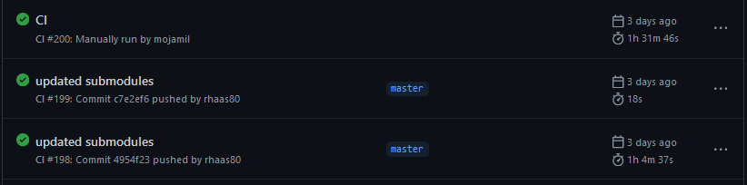
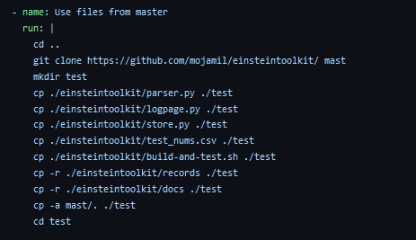
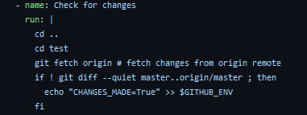
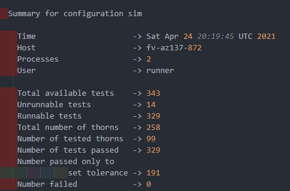
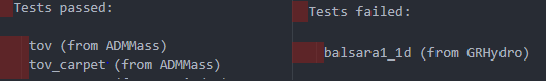
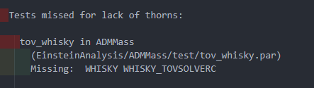
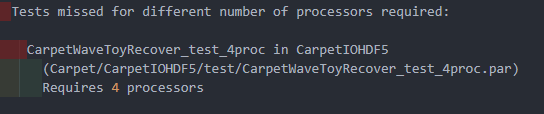
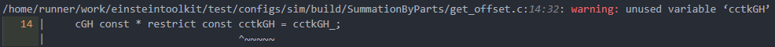
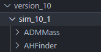

# Einstein Toolkit Automated Testing Using Github Actions

- [Einstein Toolkit Automated Testing Using Github Actions](#einstein-toolkit-automated-testing-using-github-actions)
  - [Introduction](#introduction)
  - [Explanation of Files](#explanation-of-files)
    - [main.yml](#mainyml)
    - [!build-and-test.sh](#)
    - [!parser.py](#-1)
    - [store.py](#storepy)
  - [Future Improvements](#future-improvements)
  
## Introduction

Test

## Explanation of Files

### main.yml

This file contains the steps for the workflow that need to be executed.
It checks if any jobs are running currently, sets up the environment,
and pushes all the generated log and html files to the repository.

The workflow is run on each push and can also be run manually

The first part of the workflow is checking if there is already a
workflow run in progress, and if that is true, this new run is not
performed

The second workflow run in this picture ends in 18s as the
third one was running at the same time

I checkout the gh-pages branch as that is where the scripts
are to parse and output the data.

Then all the required libraries are installed and then a clone 
of the master branch is created and the files from the gh-pages
branch are copied over and run:

Then I copied back the files with the data that needs to be stored
and push it to the github pages branch.

In order check if there was a workflow run that was cancelled the workflow
checks if there were in any changes made to the repository and if so it runs
the workflow again.

### 

### 

This python script is used to parse the log files for required data.
The parsing is done by using regex expression matching to find the
necessary information. A brief description of what each function
does

`create_summary(file)` This function looks for the summary of the tests stored in log files such
as build__2_1.log or build__1_2.log:

`get_tests(file)` Gets the name of the test that passed and failed as listed in log files such
as build__2_1.log or build__1_2.log:

`test_comp(file1,file2)` Compares the passed and failed tests from file1 and file2 and returns
which files are newly passing,newly failing, newly added and removed.

`get_times(file)` This function finds the times taken for each test in the log
file and then stores that in a dictionary and then sorts those tests in descending order by time

`longest_tests(time_dict,num_tests)` This function uses output from get_times i.e. time_dict to find
num_tests number of the longest test

`get_unrunnable(file)` This test reads the log file looking for tests that could not be run
and the corresponding reason.

 

`get_data(file)` Retrieves singular field of data from a csv and returns it as a list

`get_warning_thorns(file)` Looks at the compile log and searches for compilation warnings
and outputs the number of warnings per thorn:

`get_compile(file)` Gets the total number of compilation warnings

### store.py

`copy_tests(test_dir,version,procs)`  copies logs and diffs for each test. test_dir is where the test logs 
and diffs are.The version number and number of procs is used to store the files as shown below:

`copy_logs(version)` This copies the test logs for future use

`copy_compile_log(version)` This copies the compilation logs for future use

`copy_index(version)`  This copies the old html files showing test results for future use

`get_version()` Gets the version based on the stored files if there are no stored files
returns 1

## Future Improvements
